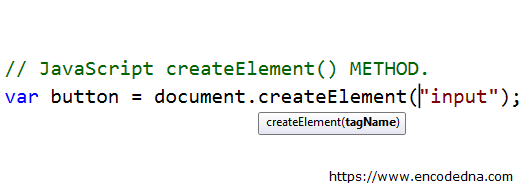
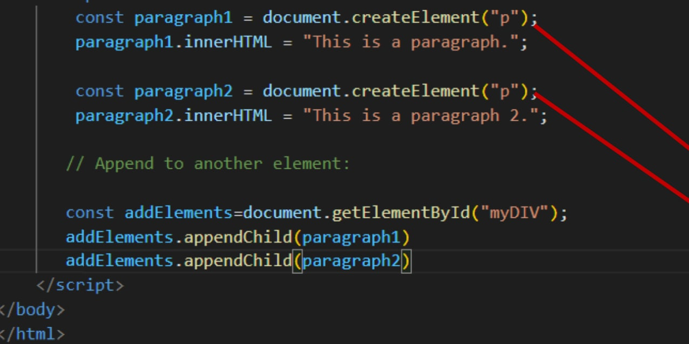
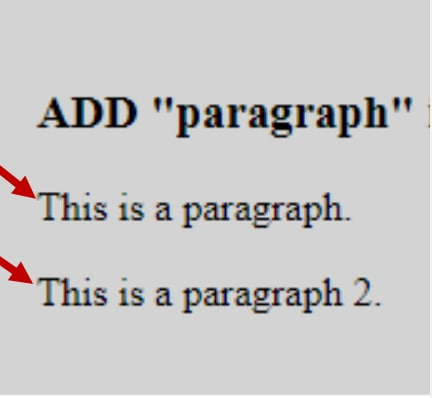

# QQQQQQQQ-01
DOM
(Document object Model)
createElement()
Усули JavaScript document.createElement() ба шумо имкон медиҳад, ки а эҷод ва баргардонед
унсури нав (як гиреҳи Элементи холӣ) бо номи барчасп.
1) createElement(elementName): Элементи html эҷод мекунад, ки тегаш аст
ҳамчун параметр гузашт. Элементи сохташударо бармегардонад
2) createTextNode(матн): гиреҳи матниро эҷод ва бармегардонад. Матни гиреҳ аст
ҳамчун параметр гузашт

#### The createElement() Methods
Усули createElement() гиреҳи элементро эҷод мекунад.

#### HTML DOM Element appendChild()
Усули appendChild() гиреҳ (элемент)-ро ҳамчун охирин замима мекунад
фарзанди унсур.
appendChild() гиреҳро ба охири рӯйхати кӯдакони
гиреҳи волидайн муайяншуда. Агар унсури кӯдаки додашуда истинод ба
гиреҳи мавҷуда дар ҳуҷҷат, пас appendChild()
Функсия онро аз мавқеи ҷории худ ба мавқеи нав интиқол медиҳад

##### appendChild()
Барои сохтани параграф бо матн.
• Унсури параграф эҷод кунед
• Гиреҳи матнӣ эҷод кунед
•Ба параграф гиреҳи матнро илова кунед
•Ба ҳуҷҷат параграфро илова кунед.

### classlist()
ClassList як қабулкунанда аст. Объекте, ки он бармегардонад, якчанд усул дорад
#### add( String [,String] )
Adds the specified classes to the elemen
#### remove( String [,String] ) 
Removes the specified classes from the element
#### item (Number)
The result is similar to calling classList[Number]
#### toggle(String[, Boolean])
If the element has no class, it adds it, otherwise it removes it. When
false is passed as the second parameter, it removes the specified
class, and if true, it adds it.

### SetAtributte
ӯ усули setAttribute () ба атрибут арзиши нав мегузорад.
Агар атрибут мавҷуд набошад, он аввал сохта мешавад

